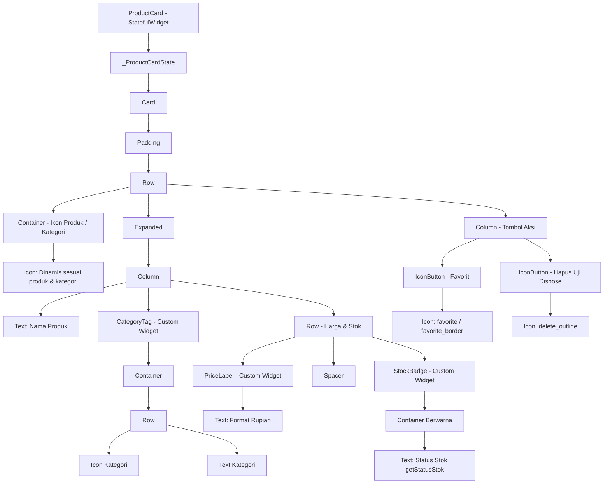

# LAPORAN PRAKTIKUM PEMROGRAMAN MOBILE
## Pertemuan 3 — Widget Dasar: Stateless vs Stateful, Struktur Project

- **Mata Kuliah**: Pemrograman Mobile
- **Nama Mahasiswa**: Bastian Yusuf Iskandar
- **NIM**: 3337240088
- **Studi Kasus**: TokoKita — Membangun Widget `ProductCard`
- **Framework**: Flutter (Dart)

---

## E. Hasil Pengamatan

Berikut adalah tabel hasil pengamatan siklus hidup (*lifecycle*) dan perilaku widget selama pelaksanaan praktikum:

| No. | Aksi yang Dilakukan | Hasil / Output yang Diamati | Screenshot (Ya/Tidak) |
|:---:|:---|:---|:---:|
| 1 | **ProductCard versi StatelessWidget** | Widget menerima objek `Product` melalui constructor dan merender tampilan kartu secara statis. Tidak memiliki method `initState()` atau `dispose()`, serta tidak dapat mengubah tampilan secara mandiri karena tidak memiliki state internal. | Ya |
| 2 | **Urutan print() initState / build / dispose** | Saat aplikasi dijalankan pertama kali, urutan log di console adalah:<br>1. `[LIFECYCLE] initState() dipanggil untuk: <Nama Produk>`<br>2. `[LIFECYCLE] build() dipanggil untuk: <Nama Produk> \| isFavorite: false`<br>Ketika item dihapus dari daftar (widget dicopot dari tree):<br>3. `[LIFECYCLE] dispose() dipanggil untuk: <Nama Produk>` | Ya |
| 3 | **setState() saat tombol favorit ditekan** | Nilai `isFavorite` berubah dari `false` menjadi `true` (atau sebaliknya). Pemanggilan `setState()` memicu Flutter untuk memanggil ulang method `build()`. Ikon berubah secara visual dari `Icons.favorite_border` (abu-abu) menjadi `Icons.favorite` (merah).<br>Output console:<br>`[EVENT] Tombol favorit ditekan! Laptop ASUS Vivo -> isFavorite: true`<br>`[LIFECYCLE] build() dipanggil untuk: Laptop ASUS Vivo \| isFavorite: true` | Ya |
| 4 | **Hot reload setelah status favorit berubah** | Ketika sebuah produk telah ditandai sebagai favorit (`isFavorite = true`), lalu dilakukan **Hot Reload** (`r`), tampilan yang diperbarui disuntikkan seketika ke Dart VM tanpa mereset state. Status favorit **tetap tersimpan (tetap bernilai true)**. | Ya |
| 5 | **Hot restart** | Ketika dilakukan **Hot Restart** (`R`), seluruh aplikasi dimulai ulang dari fungsi `main()`. Seluruh widget tree dihancurkan dan dibuat baru dari awal, sehingga status favorit **kembali ke kondisi default (false)** dan `initState()` dipanggil kembali. | Ya |

---

## F. Tugas Mandiri

### 1. Diagram Widget Tree dari ProductCard
Berikut adalah diagram struktur hierarki (*widget tree*) dari komponen `ProductCard` yang telah dibuat, mulai dari root widget hingga ke komponen pendukung terkecil (`PriceLabel`, `StockBadge`, `CategoryTag`):



---

### 2. Tabel Perbandingan StatelessWidget vs StatefulWidget

| Aspek | StatelessWidget | StatefulWidget | Contoh Nyata pada Proyek TokoKita |
|:---|:---|:---|:---|
| **Sifat State (Mutability)** | **Immutable (Tetap)**. Data/state internal tidak dapat berubah setelah widget dibangun. | **Mutable (Dinamis)**. Memiliki objek `State` terpisah yang dapat menyimpan data yang berubah sepanjang siklus hidupnya. | `PriceLabel`, `StockBadge`, dan `CategoryTag` adalah **Stateless** karena hanya menampilkan data input. Sedangkan `ProductCard` adalah **Stateful** karena menyimpan status `isFavorite`. |
| **Lifecycle Methods** | Hanya memiliki method `build(BuildContext context)`. | Memiliki siklus hidup lengkap: `createState()`, `initState()`, `didUpdateWidget()`, `build()`, dan `dispose()`. | Pada `ProductCard`, `initState()` dipakai mencatat inisialisasi, `build()` merender kartu, dan `dispose()` mencatat saat kartu dilepas dari widget tree. |
| **Mekanisme Pembaruan UI** | Tampilan hanya berubah jika widget induk (*parent*) membangun ulang widget ini dengan parameter baru. | Dapat memicu render ulang secara mandiri dengan memanggil fungsi `setState()`. | Tombol love pada `ProductCard` memanggil `setState(() { isFavorite = !isFavorite; })` untuk langsung mengubah warna dan ikon love tanpa perlu me-reload seluruh halaman. |
| **Kebutuhan Memori & Kompleksitas** | Ringan, sederhana, dan hemat memori karena tidak mengelola objek state terpisah. | Memerlukan dua class terpisah (class Widget dan class State), sedikit lebih berat karena alokasi state. | Widget pendukung visual seperti badge status cukup menggunakan StatelessWidget agar performa aplikasi tetap optimal. |

---

### 3. Widget Custom Baru: `CategoryTag`
Untuk memenuhi Tugas Mandiri Butir 3, dibuat widget custom bernama `CategoryTag` di file `lib/widgets/category_tag.dart`.

- **Fungsi**: Menampilkan kategori produk (misal: *Elektronik*, *Fashion*, *Makanan*) dengan ikon yang sesuai secara otomatis serta warna yang dapat dikustomisasi.
- **Implementasi Parameter Berbeda**:
  1. Di dalam `ProductCard`:
     ```dart
     CategoryTag(category: widget.product.category)
     ```
  2. Di bagian header halaman utama (`main.dart`) sebagai filter/tag kategori dengan parameter warna berbeda:
     ```dart
     CategoryTag(category: 'Elektronik', customColor: Colors.indigo),
     CategoryTag(category: 'Fashion', customColor: Colors.pink),
     CategoryTag(category: 'Makanan', customColor: Colors.teal),
     CategoryTag(category: 'Semua Produk', customColor: Colors.deepPurple),
     ```

---

### 4. Penjelasan Urutan Pemanggilan Lifecycle (`initState`, `build`, `dispose`)
Berdasarkan hasil pengamatan langsung pada console aplikasi:

1. **`initState()`**:
   - Dipanggil **tepat satu kali** ketika objek State pertama kali dibuat dan dimasukkan ke dalam widget tree.
   - Digunakan untuk inisialisasi data atau mendaftarkan listener/stream.
   - Pada proyek TokoKita, `initState()` mencatat log inisialisasi produk sebelum tampilan pertama kali digambar.
2. **`build()`**:
   - Dipanggil setelah `initState()`, dan akan dipanggil kembali **setiap kali terjadi perubahan state** melalui pemanggilan `setState()`.
   - Bertanggung jawab merender struktur widget tree ke layar.
   - Setiap kali pengguna menekan tombol favorit, `build()` dipanggil ulang untuk mengganti icon love abu-abu menjadi merah.
3. **`dispose()`**:
   - Dipanggil **tepat satu kali** ketika objek State dihapus secara permanen dari widget tree (misalnya saat widget dihapus dari list atau pengguna berpindah halaman).
   - Digunakan untuk membersihkan alokasi memori (*cleanup*), seperti menutup `TextEditingController`, membatalkan `Timer`, atau menghentikan `StreamSubscription`.
   - Pada pengujian, ketika tombol hapus pada salah satu `ProductCard` ditekan, fungsi `_removeProduct(index)` menghapus produk tersebut dari list, dan `dispose()` langsung terpanggil di console.

---

### 5. Penyebab Hilangnya Status Favorit saat Aplikasi Ditutup & Solusi Penyimpanan Permanen

#### Mengapa Status Favorit Hilang?
Status `isFavorite` yang dikelola menggunakan `setState()` disimpan di dalam **RAM (Volatile Memory)** sebagai properti dari instance `_ProductCardState`. Ketika aplikasi ditutup atau dimatikan oleh sistem operasi:
- Proses aplikasi dihentikan (*terminated*).
- Seluruh alokasi memori RAM yang digunakan aplikasi dibersihkan oleh OS.
- Saat aplikasi dibuka kembali, widget tree dibuat dari nol dengan nilai default (`isFavorite = false`).

#### Solusi Agar Tersimpan Permanen:
Agar status favorit dapat bertahan meskipun aplikasi ditutup (*persistent storage*), data favorit perlu disimpan ke dalam penyimpanan non-volatile (memori internal perangkat atau server cloud):

1. **`shared_preferences` / `flutter_secure_storage`**:
   - Cocok untuk menyimpan data sederhana bertipe key-value (misal: menyimpan List ID produk yang difavoritkan `['1', '3', '5']`).
2. **Database Lokal (SQLite / Hive / Isar / ObjectBox)**:
   - Cocok untuk menyimpan data terstruktur dalam jumlah banyak secara offline. Tabel produk dapat memiliki kolom boolean `is_favorite`.
3. **REST API & Database Backend (Firebase / Supabase / Laravel / Node.js)**:
   - Status favorit dikirimkan ke server melalui HTTP Request (POST/PUT/DELETE) sehingga data tersimpan di server database dan dapat diakses dari perangkat manapun saat user login.

---

## G. Troubleshooting: Penyelesaian Error Diagnostic Clang pada Platform Linux Desktop Embedding

### 1. Deskripsi Permasalahan
Saat membuka file `linux/flutter/generated_plugin_registrant.cc`, IDE menampilkan pesan diagnostic error dari Clang:
```json
{
  "resource": "tokokita/linux/flutter/generated_plugin_registrant.cc",
  "code": "unknown_typename",
  "severity": 8,
  "message": "Unknown type name 'FlPluginRegistry'",
  "source": "clang",
  "line": 9
}
```

### 2. Analisis Penyebab
- File `generated_plugin_registrant.cc` merupakan file yang di-generate otomatis oleh Flutter tooling untuk platform Linux desktop.
- File tersebut mendefinisikan fungsi `void fl_register_plugins(FlPluginRegistry* registry) { }`, namun file header pasangannya (`#include "generated_plugin_registrant.h"`) tidak di-include di baris atas file `.cc`.
- Selain itu, pada sistem operasi Windows, header native Linux `<flutter_linux/flutter_linux.h>` tidak terpasang di path include default Clang, sehingga tipe data `FlPluginRegistry` dianggap tidak terdefinisi (*unknown typename*).

### 3. Solusi Perbaikan
Dilakukan perbaikan pada dua file terkait:

1. **`linux/flutter/generated_plugin_registrant.cc`**:
   Menambahkan include header `generated_plugin_registrant.h`:
   ```cpp
   // clang-format off

   #include "generated_plugin_registrant.h"

   void fl_register_plugins(FlPluginRegistry* registry) {
   }
   ```

2. **`linux/flutter/generated_plugin_registrant.h`**:
   Menambahkan *conditional compilation* menggunakan `__has_include` beserta *forward declaration* fallback:
   ```cpp
   #ifndef GENERATED_PLUGIN_REGISTRANT_
   #define GENERATED_PLUGIN_REGISTRANT_

   #if __has_include(<flutter_linux/flutter_linux.h>)
   #include <flutter_linux/flutter_linux.h>
   #else
   typedef struct _FlPluginRegistry FlPluginRegistry;
   #endif

   // Registers Flutter plugins.
   void fl_register_plugins(FlPluginRegistry* registry);

   #endif  // GENERATED_PLUGIN_REGISTRANT_
   ```

### 4. Hasil
- Clang intellisense di lingkungan pengembangan (Windows) tidak lagi mengeluarkan error `Unknown type name 'FlPluginRegistry'`.
- Seluruh kode tetap 100% kompatibel saat di-build pada lingkungan Linux asli.
- Perintah `flutter analyze` dan `flutter test` berjalan bersih tanpa adanya warning maupun error.
